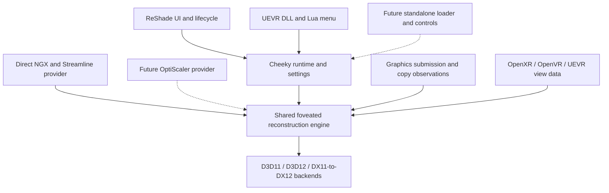

# Extensible integrations: ReShade, UEVR, and OptiScaler

Research and proposed implementation plan, 2026-09-08. Local baseline: `97f8e4e` / v0.2.4. This document proposes changes; no runtime implementation or headset validation was performed for this research.

**Implementation follow-up:** the user subsequently prioritized building the UEVR
plugin. A native adapter, resident shared-code runtime, native D3D12 observer and
Lua menu are now implemented. See [the preview guide](uevr/README.md) for the
actual scope, build/test commands and remaining headset checks. OptiScaler and
the wider provider refactor below remain future work.

**Recommendation:** retain one Cheeky rendering engine, ship ReShade and UEVR integrations, and make upscaler interception independently replaceable. Build the UEVR experience around a native DLL plus a small Lua settings panel in UEVR's menu. Investigate OptiScaler as an optional provider before committing to a large new interception layer. Preserve the existing direct NGX/Streamline provider so neither release requires OptiScaler.

## What the current code already gives us

The project is more separable than its ReShade-only packaging suggests:

| Current area | Responsibility | Refactor direction |
| --- | --- | --- |
| `src/addon.cpp:702` onward | ReShade persistence, ImGui settings, input, events, logging, startup/shutdown | Split into host adapter, settings serialization, presentation, and runtime services |
| `src/hooks.cpp` | NGX/Streamline interception, feature tracking, parameter adaptation, GPU timing | First extract provider boundaries; then split by responsibility without rewriting all hooks |
| `src/frame_contract.hpp`, `backend.hpp` | Frame metadata and backend entry points | Extend the existing contracts; separate D3D resource declarations from scalar frame metadata |
| `src/d3d11_backend.cpp`, `d3d12_backend.cpp` | Cropping and compositing | Keep shared between integrations |
| Peripheral DLAA, motion resampling, DX11/DX12 transport, DLSS-NR | Additional reconstruction passes | Keep shared, with explicit capability and lifetime requirements |
| `src/settings.cpp`, `foveation.cpp`, `gaze_policy.cpp` | Settings validation, geometry, temporal policy | Reusable core; publish coherent settings revisions |
| `src/gaze_foveation.cpp`, `openvr_gaze.cpp`, `openxr_layer/` | Tracking acquisition and matching DLSS views to eyes | Separate tracking providers from eye-association policy |
| `src/support_report.cpp` | Report creation mixed with ImGui and ReShade assumptions | Extract report service and host-supplied paths/log inventory |
| `CMakeLists.txt`, `.vcxproj`, `scripts/build.ps1` | One add-on target plus layer/tests; script uses MSBuild | Explicit source targets, with both build routes kept working |

ReShade currently provides essential execution information. `on_execute_command_list` submits gaze-copy records and calls `note_d3d12_command_list_submission`. That function associates queues with peripheral DLAA, motion-resampling resources, and timing queries. `on_present` collects resources after fence completion. `crop_motion.cpp` explicitly accounts for ReShade reporting a list before execution and bounds unsubmitted work to 64 entries.

Consequently, replacing the overlay alone does not make the engine independent. Missing submission observations can exhaust resource pools or prevent safe reuse. ReShade also reports copy/resolve, command-list reset/destruction, and resource destruction used by D3D12 eye mapping.

## What UEVR actually exposes

UEVR loads native plugin DLLs from a game's persistent `plugins` directory or its global plugin directory. Its documentation describes runtime reload. Prefer a per-game installation initially, avoiding activation in untested titles. [Plugin documentation](https://docs.uevr.io/plugins/getting_started.html)

The inspected public header provides device/swapchain/queue access, present/reset callbacks, VR rendering callbacks, stereo-view callbacks, projection/eye-offset queries, and OpenXR/OpenVR handles. It does **not** expose a complete DLSS evaluation payload or general D3D12 copy/submission event stream. A VR framework render target therefore cannot replace the current NGX evaluation entry point. The header reports plugin API 2.39.0; determine the minimum supported binary separately. [Public API](https://github.com/praydog/UEVR/blob/master/include/uevr/API.h)

There is a documentation discrepancy: the plugin guide lists C++ UI/config callbacks that are absent from the inspected public `Plugin.hpp`. Do not design against those advertised overrides without checking the pinned SDK. [Actual C++ plugin helper](https://github.com/praydog/UEVR/blob/master/include/uevr/Plugin.hpp)

Two UI approaches remain viable:

| Approach | Benefit | Cost | Decision |
| --- | --- | --- | --- |
| Native DLL + Lua panel in UEVR's existing menu | Best fit for the requested integrated controls; delegates menu rendering/input to UEVR | Small versioned message protocol and Lua packaging | Preferred initial route |
| Native DLL with its own ImGui context and VR renderer | Reuses more of our existing C++ widgets | Own input handling, graphics state, descriptors, resets, and menu behavior | Fallback; also useful for a future standalone overlay |

Lua provides `on_draw_ui`, `on_lua_event`, and script-reset callbacks. Lua-to-native commands can use `dispatch_custom_event`. Prototype message delivery and controller usability in the headset before expanding the panel. [Lua callbacks](https://docs.uevr.io/plugins/lua/callbacks.html), [Lua API](https://docs.uevr.io/plugins/lua/api.html)

The native example creates its own ImGui context and renders through the DX11/DX12 VR framework callbacks. This establishes a rendering route, not automatic compatibility with our existing ReShade ImGui bindings. Keep contexts and host-specific ImGui dependencies isolated. [Official rendering example](https://github.com/praydog/UEVR/blob/master/examples/example_plugin/Plugin.cpp)

## Where OptiScaler can help

OptiScaler intercepts several upscaler input APIs and routes them to a chosen output backend. That is valuable compatibility infrastructure, including the possibility of reaching games through non-DLSS inputs. It does not by itself establish VR eye mapping or make our DLSS reconstruction work on non-NVIDIA GPUs. [Project overview](https://github.com/optiscaler/OptiScaler)

The useful source boundary is its DLSS output backend. `DLSSFeatureDx12` performs feature creation, evaluation through `NVNGXProxy`, and release. A Cheeky integration could perform cropped reconstruction at this boundary while OptiScaler owns incoming game calls. DX11 has a corresponding backend. This is a proposed integration, not an existing extension mechanism. [DX12 DLSS backend](https://github.com/optiscaler/OptiScaler/blob/master/OptiScaler/upscalers/dlss/DLSSFeature_Dx12.cpp), [DX11 DLSS backend](https://github.com/optiscaler/OptiScaler/blob/master/OptiScaler/upscalers/dlss/DLSSFeature_Dx11.cpp)

I did not find a public external upscaler-provider SDK in the reviewed loader, exports, and feature interfaces. `LoadAsiPlugins` loads ASI files and optionally calls `InitializeASI`; that alone does not hand them DLSS resources or lifecycle callbacks. Treat integration as source-level work or an upstream API proposal until a supported interface is demonstrated. The repository tree queried during research resolved to `f78a26e979b2f81b1ce266fd372932c524b86342`; web source views were on `master`, so pin and recheck a single commit for implementation. [ASI loader](https://github.com/optiscaler/OptiScaler/blob/master/OptiScaler/dllmain.cpp), [Exports](https://github.com/optiscaler/OptiScaler/blob/master/OptiScaler/Source.def), [Internal feature interface](https://github.com/optiscaler/OptiScaler/blob/master/OptiScaler/upscalers/IFeature_Dx12.h)

| OptiScaler approach | Assessment |
| --- | --- |
| Merely load Cheeky as an ASI | May simplify loading; does not eliminate our interception code |
| Intercept OptiScaler's outgoing NGX calls | Possible experiment, but preserves hook-chain complexity and risks intercepting the same work twice |
| Integrate Cheeky at the DLSS backend through a small upstream extension | Preferred long-term cooperation: one owner of game interception, reusable Cheeky engine |
| Maintain an OptiScaler fork | Useful bounded proof of concept; significant ongoing release/merge burden |
| Copy its interception subsystem into this repository | Likely imports broad state/config/quirk dependencies; do not choose without proving a narrow extraction |

OptiScaler's outer DX12 feature pipeline can redirect output through scaling, sharpening, and other passes. The adapter must explicitly agree on the target extent and output state at its boundary. Disable overlapping overrides in the first experiment; later define ownership so supersampling, sharpening, and resolution overrides cannot be applied twice. [DX12 evaluation pipeline](https://github.com/optiscaler/OptiScaler/blob/master/OptiScaler/upscalers/IFeature_Dx12.cpp)

The prototype must test both managed OptiScaler features and native passthrough: its DX12 input dispatch distinguishes them. A backend-only change does not necessarily cover every DLSS call. [DX12 input routing](https://github.com/optiscaler/OptiScaler/blob/master/OptiScaler/inputs/NVNGX_DLSS_Dx12.cpp)

OptiScaler documents loading ReShade alongside it, but coexistence instructions are not proof that Cheeky's interception is compatible. Keep that as a test case. Preserve source notices when reusing code; the upstream license file contains GPLv3, as does this project's licensing basis. [Mod coexistence](https://github.com/optiscaler/OptiScaler/wiki/Compatibility-with-other-mods-%28Reshade%2C-SpecialK%29), [License](https://github.com/optiscaler/OptiScaler/blob/master/LICENSE)

## Architecture decision: separate host from interception

UEVR and OptiScaler solve different parts of the problem. A UEVR menu should work with either our direct interception or a future OptiScaler provider.



Use a small set of internal interfaces, not a general third-party plugin framework:

1. **Runtime control:** start, disable, stop, apply settings revision, query capabilities and diagnostics. Disable must return to the original full-frame route without reloading DLLs.
2. **Host services:** configuration location, input actions, log/report presentation, lifecycle notifications. Rendering code must not include ReShade, UEVR, Lua, or ImGui headers.
3. **Upscaler provider:** normalized frame metadata plus typed D3D resources and create/evaluate/release operations. Preserve provider-specific optional parameters and original-call context; flattening only today's fields would lose compatibility. Private center/peripheral feature evaluations must bypass interception recursively.
4. **Graphics observer:** command-list generation, submission phase, actual queue, completion, copies/resolves, and invalidation. ReShade implements one source; a native D3D observer serves UEVR and standalone. An OptiScaler adapter may supply observations only where its contract proves equivalent coverage.
5. **View/tracking provider:** timestamped session/view data, projections, resource/subresource associations, and validity. Acquisition is independent of smoothing, crop placement, and reset policy.

Preserve `DlssFrameContract` and the existing backend code as the starting point. Add explicit frame/session/feature generations and eye-association evidence where necessary. A viewport ID or callback order is not inherently a left/right eye identity.

Suggested eventual source layout:

```text
src/core/                 settings, geometry, policies, diagnostic snapshots
src/runtime/              lifecycle, feature registry, services, ownership
src/providers/ngx/        current direct NGX interception
src/providers/streamline/ current Streamline interception
src/providers/optiscaler/ optional future adapter
src/graphics/             native event observation and completion tracking
src/backends/             existing D3D processing and transport
src/tracking/             OpenXR, OpenVR, UEVR data adapters
src/ui/                   shared settings metadata and ReShade ImGui panel
src/hosts/reshade/         ReShade entry points, events, persistence
src/hosts/uevr/            UEVR entry points and Lua control bridge
src/hosts/standalone/      future loading and control surface
```

Extract boundaries before doing wholesale file moves, especially in `hooks.cpp`. Build common code as internal libraries. Keep the ReShade package self-contained initially. Physical runtime-DLL packaging for UEVR is determined by the lifecycle prototype below; it does not require a second rendering implementation.

## Critical contracts and prototype decisions

**GPU execution:** observe the queue executing the DLSS command list, not merely UEVR's presentation queue. Normalize pre-submit ReShade events separately from post-submit native observations. Signal completion only after the corresponding submission, and retain resources/descriptors until it completes. Cover reused/reset/discarded lists, multiple queues, wrappers, device replacement, and internal transport work. Never substitute a fixed frame delay for completion. If required coverage is absent, disable dependent passes and report why.

**Late injection:** UEVR can arrive after DLSS initialization and feature creation. Test hooks against already-loaded modules and active handles. Where creation metadata cannot be safely recovered, leave the original evaluation running and report that DLSS must be toggled or the game restarted. Do not fabricate a feature contract from incomplete evaluation parameters.

**Unload/reload:** the inspected UEVR loader clears callbacks and calls `FreeLibrary`; its public plugin helper offers no explicit pre-unload shutdown callback. Our current `stop_interception()` waits for a worker, so it cannot simply be moved into `DllMain`. [UEVR unload implementation](https://github.com/praydog/UEVR/blob/master/src/mods/PluginLoader.cpp)

Prototype a thin UEVR adapter backed by a separate process-resident Cheeky runtime DLL if a safe pre-unload contract cannot be established. Put all game detours, workers, and GPU ownership in that runtime. The adapter pushes copied input and pulls snapshots; the runtime must not retain callbacks into an unloadable adapter. Detach can request disabling through a nonblocking atomic operation, with draining outside loader lock. Reload reconnects to the same versioned runtime without installing duplicate hooks. Physical runtime replacement can require a game restart. Validate this behavior before advertising reload support; pinning the plugin DLL alone is insufficient lifecycle design.

**One processing owner:** both packages may be distributed, but initially select one Cheeky processing integration per game. Add a process-wide ownership handshake before installing hooks, including detection of older add-ons that do not implement the handshake. Refuse the second owner with an actionable message. ReShade itself may still run for unrelated effects. Future simultaneous frontends should attach to one runtime. A future OptiScaler provider must disable the corresponding direct hooks instead of stacking both providers.

**Stereo and gaze:** retain the OpenXR layer and OpenVR provider for the first UEVR release. Test using UEVR view data to reduce dependence on heuristic mapping, but distinguish projection availability from proof that an NGX evaluation belongs to that eye. Keep automatic alignment, valid gaze, and manual fallback separate capabilities. Preserve existing ABI 4 and rejection of unsupported array slices/quad views; adding interfaces does not add support for those layouts.

Do not promise layer-free OpenXR eye tracking merely because the host exposes a session. Extensions are enabled at instance creation, and action-set attachment has lifecycle constraints. Removing the layer needs a dedicated initialization and input-ownership design. [OpenXR instance creation](https://registry.khronos.org/OpenXR/specs/1.0/man/html/xrCreateInstance.html), [Action-set attachment](https://registry.khronos.org/OpenXR/specs/1.0/man/html/xrAttachSessionActionSets.html)

**Settings and UI:** define common keys, types, defaults, ranges, migrations, and expensive-change commit behavior. Retain existing ReShade keys initially. UEVR owns a versioned Cheeky file under its game configuration directory, with explicit import/export for moving settings between hosts. Publish complete validated settings revisions so UI edits cannot expose a mixture of old and new values to an evaluation. Persist off the render path.

Use a namespaced Lua/native protocol with schema version, request ID, settings revision, bounded payloads, validation, and acknowledgements. Queue updates and throttle diagnostic snapshots; do not invoke Lua from NGX hooks or broadcast full reports every frame. Handle script restart, missing DLL, and protocol mismatch visibly. Keep all settings policy in C++; generate simple Lua control metadata where helpful to prevent drift.

**Capabilities and support:** distinguish host, interception provider, graphics observation coverage, active renderer, eye mapping, gaze source, timing availability, and reason for passthrough. Make reports use host-supplied paths instead of assuming `ReShade.log` or that NVIDIA DLLs live beside an `.addon64`. Audit the module-relative DLSS-NR runtime search when changing packaging. Existing experimental NR remains opt-in and should not block the first UEVR SR milestone.

## Implementation sequence and acceptance gates

| Stage | Deliverable | Acceptance gate |
| --- | --- | --- |
| 0. Feasibility | Small UEVR menu/lifecycle probe; native submission probe; minimal OptiScaler backend experiment | Headset controls work; late injection behavior known; safe unload strategy chosen; OptiScaler can supply the necessary contract or is explicitly deferred |
| 1. Shared runtime extraction | Settings/schema, diagnostics/report service, host services, common rendering targets; ReShade adapter | Existing ReShade behavior and settings preserved; no host/UI headers in core/backends; both build paths succeed |
| 2. Provider and graphics boundaries | Existing NGX/Streamline provider behind explicit contracts; native queue/completion observer | Same frames reach the engine; recursion/fallback tested; no premature reuse or accumulating pending resources |
| 3. UEVR SR preview | Native plugin, Lua menu, persistence, capability panel, ownership guard | Hogwarts Legacy UEVR works with ReShade absent; both eyes correct; toggles, resolution changes, VR re-entry and reload policy verified |
| 4. Release parity | Broader DX11/DX12 coverage, tracking, support reports, packaging | Tested feature matrix published; unsupported paths fail safely; both release artifacts produced from one version |
| 5. Optional providers | OptiScaler adapter/upstream proposal if stage 0 is promising; standalone loading afterward | One interception owner; equivalent frame/lifetime contract; isolated compatibility and performance results |

Stage 0's OptiScaler experiment should first run a transparent pass-through, then a fixed center crop, then peripheral DLAA, moving crops, and stereo. Require stable feature identity, full input/output extents, motion conventions, reset information, actual submission completion, and an original fallback. Exercise backend changes and feature recreation. Record which input routes work. If reuse only means loading another DLL that still detours NGX, it has not achieved the interception simplification being investigated.

For an upstream proposal, the minimum useful interface is create/evaluate/release plus frame resources/metadata, scoped access to the original backend, and queue/completion observation. An evaluation-only callback is insufficient. Draft a concrete proposal after the probe; contacting maintainers is a separate action.

## Verification and release scope

Reuse the current default tests, `--d3d12-composite`, and `--motion-resample`. Add meaningful coverage for provider-equivalent frame translation, unknown parameters, failed initialization and fallback, coherent settings revisions/migrations, duplicate ownership, and submission/reset/discard/fence ordering. Keep WARP validation distinct from actual NVIDIA and headset validation.

Use Hogwarts Legacy as the first UEVR title because the README already records it as tested. Regression-check ACC/native OpenVR and an existing flat-screen title through ReShade. Expand hardware coverage to DX11 direct/transport and DX12 NGX/Streamline, fixed/simulated/real gaze, different motion-vector resolutions, resize, DLSS toggling, and flat-to-VR transitions. Compare image quality and total GPU cost with equivalent settings, not just the center DLSS timer.

Start UEVR support with Native Stereo. Verify Synchronized Sequential separately and leave AFR unsupported until temporal history behavior is demonstrated; these modes have different sequencing. [UEVR rendering modes](https://github.com/praydog/UEVR)

Ship separate versioned ReShade and UEVR ZIPs, plus the existing OpenXR installer. The UEVR package contains its plugin, any lifecycle-required runtime dependency, and `scripts/cheeky_foveated_dlss.lua`, laid out for the game's configuration directory. Lua scripts autoload from that directory's `scripts` folder. [Lua installation](https://docs.uevr.io/plugins/lua.html)

Standalone remains a later host using the same engine, providers, graphics observer, and settings schema. Start its eventual prototype with an established ASI loader and file/hotkey controls; evaluate a dedicated loader/proxy and VR overlay separately. Removing UEVR does not itself provide VR rendering or headset UI, and removing ReShade does not eliminate the need for in-process loading and graphics observation.

The immediate implementation starting point is stage 0, followed by the smallest shared-runtime extraction needed for the selected UEVR route. OptiScaler should influence the provider boundary now, while remaining optional until its integration is proven.
