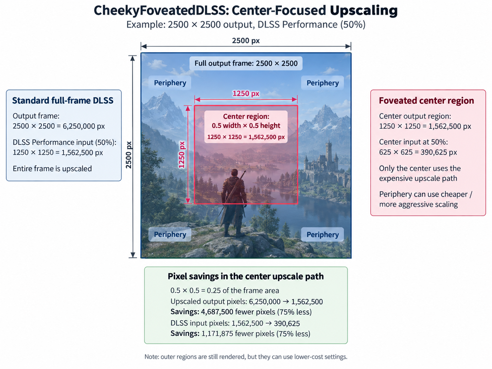
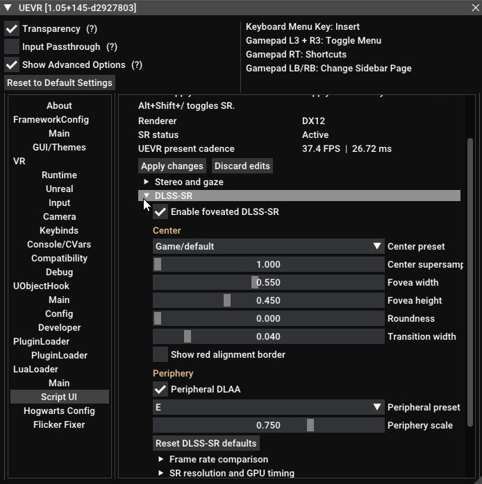

# Cheeky Foveated DLSS

Reduce the cost of DLSS Super Resolution by concentrating it on the center of the image. Available as a **ReShade add-on** or **UEVR plugin**, for Direct3D 11 and Direct3D 12 games, including VR. With DLSS Performance FPS gains of 20%+ are standard, even more with eye tracked headsets which can make the foveated region even smaller.

## Requirements

- Windows 10/11, 64-bit, and an NVIDIA RTX GPU.
- A D3D11 or D3D12 game with DLSS Super Resolution.
- Either ReShade **with full add-on support**, or UEVR with a compatible plugin API.

## Compatibility
This should work with most games that have DLSS. Here is a non-exhaustive list of community reports whether a game is supported. 

[**Compatibility List**](https://docs.google.com/spreadsheets/d/1BY-OAfYzkDefQWvpHCd_bhzDdIYlTb6RkptmV1h70Ng/edit?usp=sharing) 

Disclaimer: If a game is not on this list or the game is marked as not-working, this does not necessarily mean it is not supported. 
These are user submitted reports and issues may be user specific. 

Please help maintain and expand this list by submitting if a game has worked for you using the [**Survey Link**](https://tally.so/r/eqVaWJ)

## Installation

Close the game and choose **one** integration. Do not load the Cheeky Reshade add-on and plugin together.

### ReShade add-on

1. Install 64-bit **ReShade with full add-on support** into the game, selecting D3D11 or D3D12 as appropriate.
2. Copy `CheekyFoveatedDLSS.addon64` beside the game executable and ReShade DLL.
3. Complete the **required VR setup below** if playing in VR. Open the controls under **ReShade → Add-ons → Cheeky Foveated DLSS**.

### UEVR plugin

1. Use UEVR with plugin API **2.39.0 or compatible newer 2.x**. Remove ReShade and the Cheeky ReShade add-on from the game if previously installed.
2. Extract the UEVR ZIP into the game's **UEVR configuration directory**, normally `%APPDATA%\UnrealVRMod\<game-executable-name>`. Keep the `plugins/` and `scripts/` folders intact. Do not extract it beside the game executable. [Folder layout](uevr/README.md#installation)
3. Complete the **required VR setup below**, start the game and inject UEVR. Open the controls under **UEVR → LuaLoader → ScriptUI → Cheeky Foveated DLSS**. You may need to enable 'Show Advanced Options' in top left to see these menus.

Remove ReShade from the game when using the UEVR plugin.

### Required VR setup

**For OpenXR, run `CheekyOpenXRSetup.exe` from the matching release. This is required even without an eye-tracked headset.** It installs the shared layer used for automatic stereo alignment and eye calibration. Install it once for all OpenXR games, and update it alongside Cheeky.

| Game's VR API | OpenXR installer |
| --- | --- |
| OpenXR, including UEVR in OpenXR mode | **Required** |
| OpenXR through SteamVR or OpenComposite | **Required** |
| Native OpenVR/SteamVR, such as ACC in SteamVR mode | Not needed; calibration is built in |
| Flat-screen play | Not needed |

SteamVR's presence alone does not identify the game's API. OpenXR games still need the installer when SteamVR is their OpenXR runtime.

Keep **Automatic stereo alignment** and **Automatic eye calibration** enabled. Manual offsets are not a reliable replacement: eye assignments can change between loading videos, menus and gameplay.

### First launch

1. Enable DLSS in the game's graphics settings and open Cheeky's controls.
2. Start with the defaults and **Foveation center → Fixed**. Fixed placement still uses automatic stereo alignment and calibration in VR.
3. Enable the red alignment border. Verify it overlaps 100%, it should appear as one rectangle. If it does not in **Diagnostics → Eye calibration** (under **Diagnostics and support** in UEVR), check for **Active**, valid samples and correctly placed regions in both eyes. Turn the border off afterward.
4. Adjust fovea width/height, height offset and transition width to taste. Sliders apply on release.

If calibration stays inactive or reports manual fallback, check the installed layer and collect a support report. Do not rely on a manual eye-order adjustment staying correct across scenes, but you can use it to see the effect.

## Settings

Start with defaults, then compare native and foveated DLSS timings in the performance panel. Smaller foveas reduce processing cost; higher center supersampling improves center resolution at additional cost. Results depend on the game and GPU.

- **Eye tracking:** select **Runtime gaze (OpenXR / OpenVR)** only with a compatible eye-tracked headset and runtime. Quest 3 users should use **Fixed** with automatic alignment.
- **DLSS-NR:** experimental and off by default. Compatible NVIDIA runtimes must be supplied separately. Read the [DLSS-NR instructions](USAGE.md#experimental-dlss-nr-support) before enabling it.
- [Full settings reference](USAGE.md) · [Eye calibration details and limitations](EYE-CALIBRATION.md)

## Troubleshooting
1. Use latest DLSS files using DLSS Swapper
2. Make sure no overrides are set in NVidia Profile Inspector, NVidia App, or DLSS Swapper
3. I found games don't like some presets (Example Mortal Shell 2 causes smearing if center region is set to Preset K). Try other Presets.
4. UEVR AFW is current not supported, use Native Stereo
5. Eye Tracking: You can use https://github.com/maluoi/openxr-explorer to verify eye tracking works

## Eye tracking (experimental)

I do not own an eye tracked headset, however due to the open source nature of the
project @Williem3 was able to add in the initial implementaiton. I cannot fully validate
the eye tracking experience but rely on community reports if there are issues.

Eye tracking uses the OpenXR layer installed in the [main installation steps](README.md#installation).
It requires an eye-tracked headset and a runtime that supplies usable gaze input.
Automatic stereo alignment works without eye tracking; Quest 3 users should use
**Fixed** with **Automatic stereo alignment** and adjust **Height offset** as needed.

To enable real tracking, select **Foveation center > Runtime gaze (OpenXR / OpenVR)**. For validation,
disable the game's built-in eye-tracked foveation, enable the red alignment border,
and open **Diagnostics > OpenXR eye tracking**. Check **System support**, **Gaze
action active**, **Tracking valid**, and **Using gaze**, along with stable, distinct
DLSS-view mappings for both eyes. **Eye gaze extension: Yes** alone does not mean
the headset supplies eye tracking.

Valid gaze sets both eye centers directly; it needs no manual stereo X offset.
SR and foveated NR share gaze and automatic alignment. NR continues tracking with
SR foveation disabled; **Use DLSS-SR size and shape** only links region settings.
**Fallback height offset** only adjusts fixed placement when gaze is unavailable
and does not shift valid gaze. If tracking is unavailable, a red message appears
directly below the selector and the add-on falls back to fixed placement, using
automatic alignment where available and saved manual placement otherwise.
Temporary signal loss holds the last valid gaze for 100 ms, then returns toward
the fixed fallback over 150 ms.

Separate, packed and array-slice submissions can use marker calibration on D3D11 and D3D12. Quad views are not supported. See [Eye calibration](EYE-CALIBRATION.md) for path-specific limits.
Missing, stale, or ambiguous data also causes fallback. To test motion without an
eye tracker, use [Simulated gaze](DEVELOPMENT.md#simulated-gaze-no-eye-tracker-required); this does not validate real eye-tracker input or latency.

## Updating and removing

Close the game. For **ReShade**, replace the `.addon64` in the game folder. For **UEVR**, replace both plugin DLLs and the Lua script using the complete ZIP. For **OpenXR**, also run the matching `CheekyOpenXRSetup.exe`. Keep existing settings.

To remove the shared layer, uninstall **Cheeky OpenXR Support** in Windows **Settings → Apps**. Remove the add-on or plugin separately. OpenXR stereo calibration requires the layer to remain installed.

## Compatibility and help

Previously tested games include Forza Horizon 6, Red Dead Redemption 2, Assetto Corsa Competizione, Stellar Blade Demo, and Hogwarts Legacy with UEVR. Compatibility varies by build and integration; this list is not a guarantee for every update. New OpenXR/D3D12 calibration paths still need broader game testing.

Use **Report an issue...** in Cheeky's panel to create a diagnostic ZIP and open a GitHub report. Describe the problem and attach the ZIP; nothing is uploaded automatically. [Report details](USAGE.md#reporting-a-problem)

## Development and support

[Build instructions](DEVELOPMENT.md)

### Help me test eye tracking on real hardware
If Cheeky Foveated DLSS has given you smoother VR, extra FPS, or room to turn up the resolution, please consider supporting its development.

Any amount helps toward the goal of funding an eye tracked headset, donating is entirely optional. Cheeky Foveated DLSS is free and open source under the [GNU GPL v3](LICENSE); third-party components retain their own licenses. 
